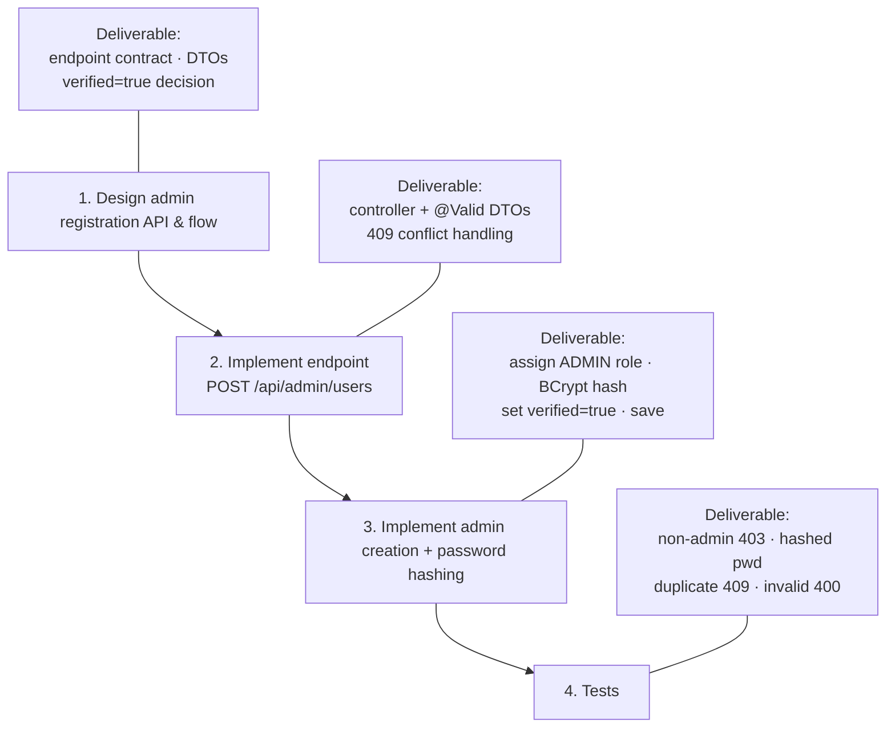
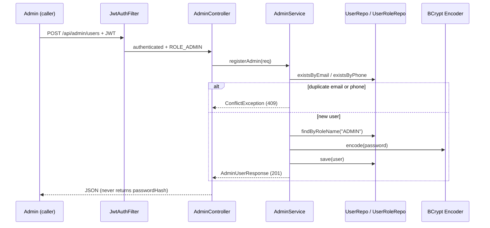
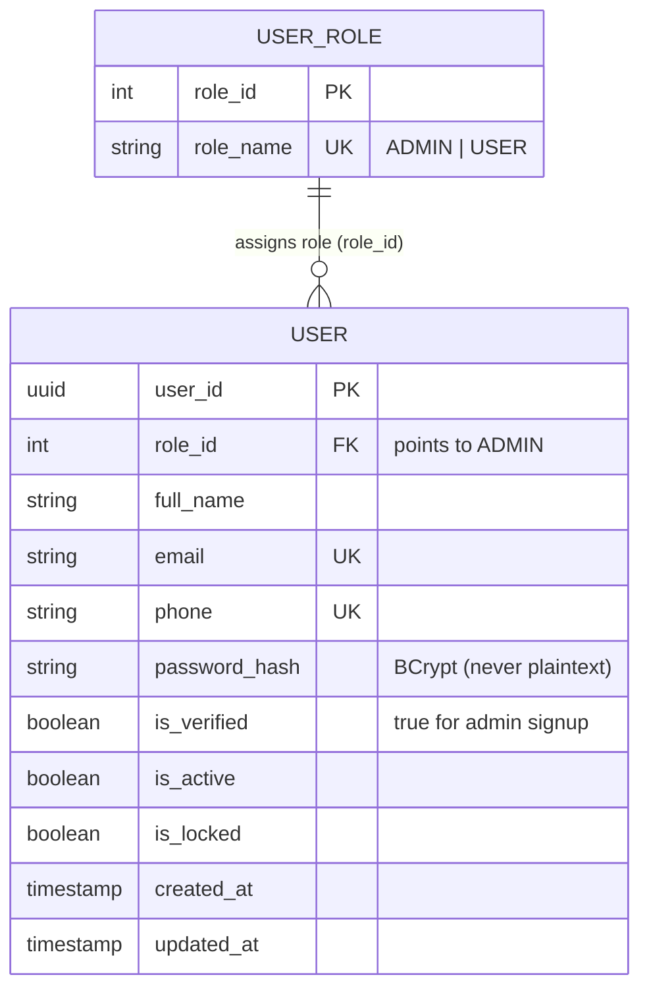
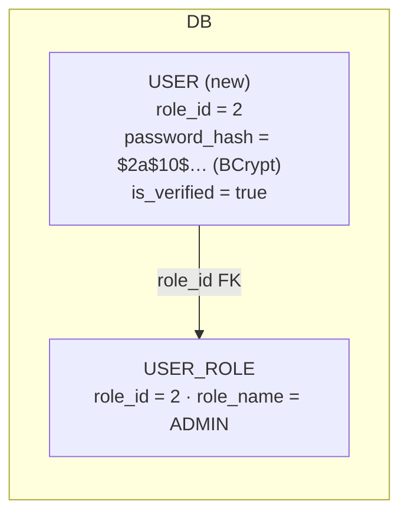

# Admin Registration — Design Overview

> **User Story:** As an Admin, I want to be able to register another admin so that I can grant authorized users administrative access to the system.

---

## Subtasks

1. Design admin registration API & flow
2. Implement admin registration endpoint
3. Implement admin creation + password hashing
4. Tests

---

## Acceptance Criteria

- **Given** I am authenticated as an `ADMIN`, **when** I `POST /api/admin/users` with valid full name, email, phone number and password, **then** a new user with role `ADMIN` is created and a `201` is returned (never exposing the password hash).
- **Given** the email or phone number already exists, **then** the request returns `409` with a clear message.
- **Given** I am authenticated as a non-admin `USER` (or unauthenticated), **when** I `POST /api/admin/users`, **then** the request returns `403`/`401`.
- **Given** an invalid email or a weak password, **then** the request returns `400` with validation errors.
- **Given** a new admin is created, **then** their password is stored as a BCrypt hash (not plaintext).

---

## Diagram 1 — Subtask Flow

---

## Diagram 2 — API Request Flow

---

## Diagram 3 — Data Model

**New admin row:**

---

## Design Details

| Item | Value |
|---|---|
| Endpoint | `POST /api/admin/users` |
| Authorization | Class-level `@PreAuthorize("hasRole('ADMIN')")` on `AdminController` (inherited) |
| Request DTO | `AdminRegistrationRequest { full_name, email, phone_number, password }` |
| Response DTO | `AdminUserResponse { id, full_name, email, phone_number, role }` |
| Role assignment | `userRoleRepository.findByRoleName("ADMIN")` |
| Password | `passwordEncoder.encode(...)` → BCrypt (bean already exists) |
| Initial state | `verified = true`, `active = true`, `locked = false` |
| Conflicts | `existsByEmail` / `existsByPhone` → `409` |

---

## Implementation Touch Points (Java files)

| File | Change |
|---|---|
| `backend/src/main/java/com/example/smsfraud/admin/AdminController.java` | Add `POST /api/admin/users` method |
| `backend/src/main/java/com/example/smsfraud/admin/AdminService.java` | Add `registerAdmin(...)` to the interface |
| `backend/src/main/java/com/example/smsfraud/admin/AdminServiceImpl.java` | Implement creation + BCrypt + role assignment |
| `backend/src/main/java/com/example/smsfraud/admin/dto/AdminRegistrationRequest.java` | New request DTO |
| `backend/src/main/java/com/example/smsfraud/admin/dto/AdminUserResponse.java` | New response DTO |

No changes needed to `SecurityConfig`, `UserRole`, or `DatabaseSeeder` — the `ADMIN` role and BCrypt bean already exist.
